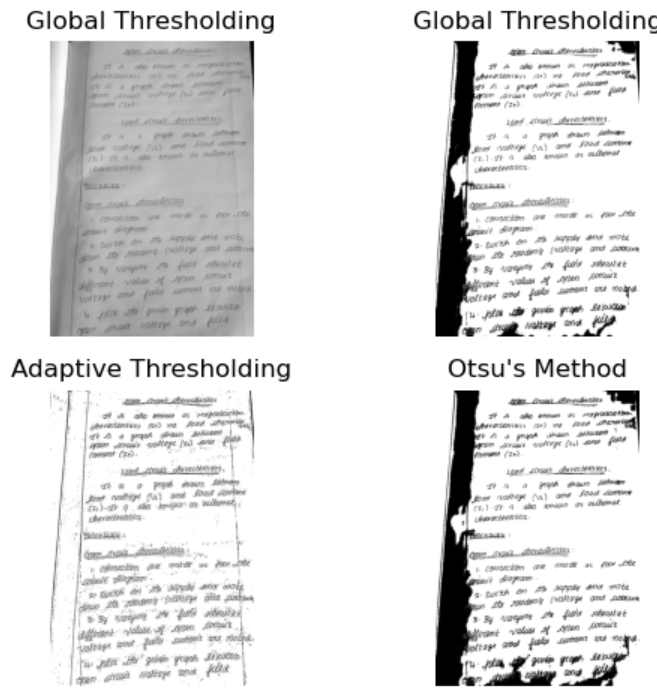

# THRESHOLDING
## Aim
To segment the image using global thresholding, adaptive thresholding and Otsu's thresholding using python and OpenCV.

## Software Required
1. Anaconda - Python 3.7
2. OpenCV

## Algorithm

### Step1:
Load the necessary packages.
### Step2:
Read the Image and convert to grayscale.
### Step3:
Use Global thresholding to segment the image.
### Step4:
Use Adaptive thresholding to segment the image.
## Step5:
Use Otsu's method to segment the image and display the results.

## Program

```python
import cv2
import matplotlib.pyplot as plt

img = cv2.imread('page3.jpg')
gray = cv2.cvtColor(img, cv2.COLOR_BGR2GRAY)

_, global_thresh = cv2.threshold(gray, 127, 255, cv2.THRESH_BINARY)

adaptive = cv2.adaptiveThreshold(gray, 255, cv2.ADAPTIVE_THRESH_GAUSSIAN_C,
                                 cv2.THRESH_BINARY, 11, 2)

_, otsu = cv2.threshold(gray, 0, 255, cv2.THRESH_BINARY + cv2.THRESH_OTSU)

plt.subplot(2, 2, 1)
plt.imshow(gray, cmap='gray')
plt.title("Global Thresholding")
plt.axis('off')

plt.subplot(2, 2, 2)
plt.imshow(global_thresh, cmap='gray')
plt.title("Global Thresholding")
plt.axis('off')

# Adaptive Thresholding
plt.subplot(2, 2, 3)
plt.imshow(adaptive, cmap='gray')
plt.title("Adaptive Thresholding")
plt.axis('off')

# Otsu's Method
plt.subplot(2, 2, 4)
plt.imshow(otsu, cmap='gray')
plt.title("Otsu's Method")
plt.axis('off')

# Show the plot
plt.tight_layout()
plt.show()

```
## Output



## Result
Thus the images are segmented using global thresholding, adaptive thresholding and optimum global thresholding using python and OpenCV.
